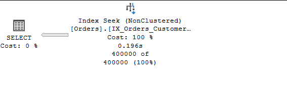
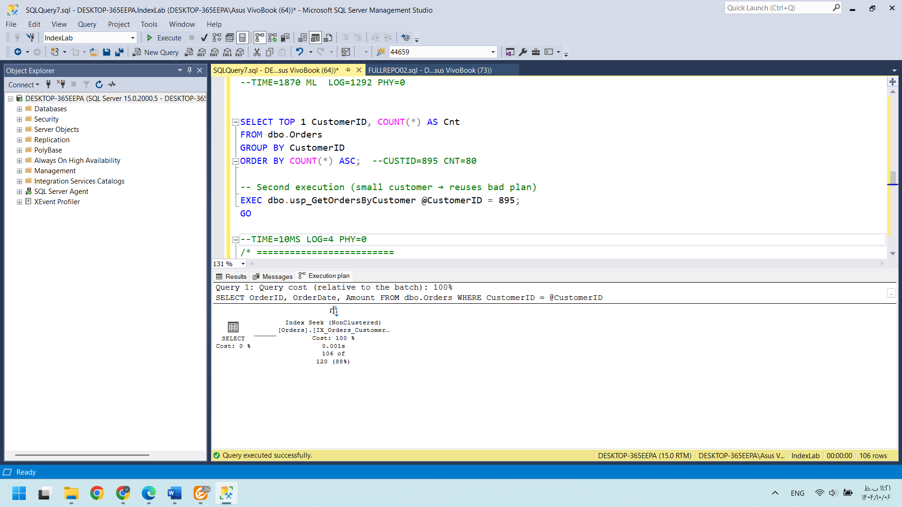
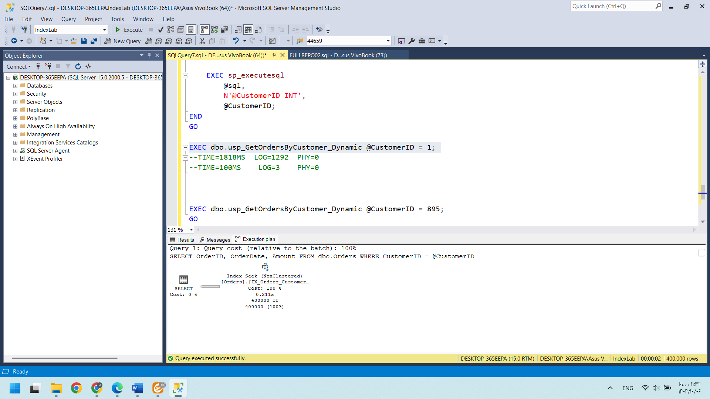
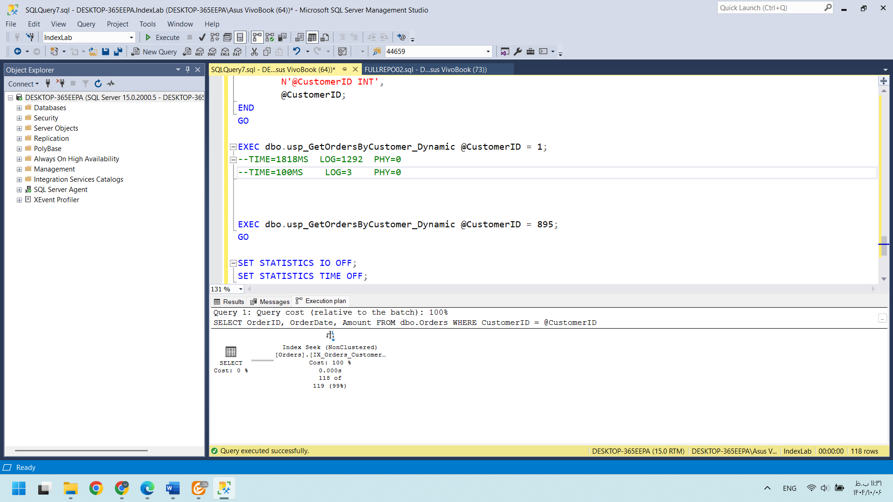
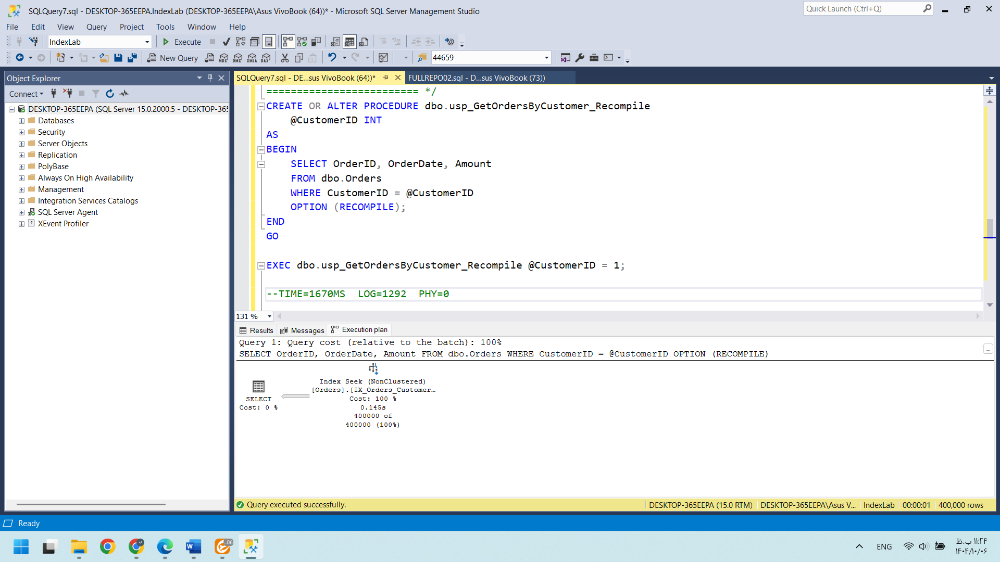
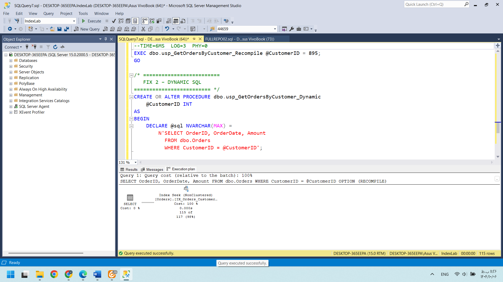

# -Parameter-Sniffing-in-SQL-Server
##**Demonstrates the impact of parameter sniffing on execution plans and performance in SQL Server. Compares simple SPs, dynamic SQL, and OPTION(RECOMPILE to mitigate performance issues.**

## Scripts
All SQL scripts used in this project are available here: [folder](FullReproParameterSnifing.sql):

1. Creating Table
 ```SQL
DROP TABLE IF EXISTS dbo.Orders;
GO

CREATE TABLE dbo.Orders (
    OrderID INT IDENTITY PRIMARY KEY,
    CustomerID INT NOT NULL,
    OrderDate DATE NOT NULL,
    Amount DECIMAL(10,2) NOT NULL
);
GO
```
   
2. Inserting 1000000 skewed sample data (large and small customers):
```SQL
INSERT INTO dbo.Orders (CustomerID, OrderDate, Amount)
SELECT
    CASE 
        WHEN n <= 400000 THEN 1
        ELSE ABS(CHECKSUM(NEWID())) % 5000 + 2
    END,
    DATEADD(DAY, -n % 365, GETDATE()),
    ABS(CHECKSUM(NEWID())) % 1000
FROM (
    SELECT TOP (1000000)
        ROW_NUMBER() OVER (ORDER BY (SELECT NULL)) AS n
    FROM master..spt_values a
CROSS JOIN master..spt_values b
) x;
GO
SELECT COUNT(*) FROM ORDERS;
GO
```
3.Creating a non-clustered index on CustomerID to optimize query performance:
```SQL
DROP INDEX IF EXISTS IX_Orders_CustomerID ON dbo.Orders;
GO
CREATE NONCLUSTERED INDEX IX_Orders_CustomerID
ON dbo.Orders (CustomerID)
INCLUDE (OrderDate, Amount);
GO
```
4. Creating SimpleSP
```SQL
DROP PROC IF EXISTS dbo.usp_GetOrdersByCustomer;
GO
CREATE OR ALTER PROCEDURE dbo.usp_GetOrdersByCustomer
    @CustomerID INT
AS
BEGIN
    SELECT OrderID, OrderDate, Amount
    FROM dbo.Orders
    WHERE CustomerID = @CustomerID;
END
GO
```
5.Testing Simple SP with a customer that has many orders
```sql
EXEC dbo.usp_GetOrdersByCustomer @CustomerID = 1;
GO
```
execution plan: [RealExecPlan](ExecPlanProcLargeAmount.sqlplan)

6.Testing Simple SP with a customer that has few orders:
```sql
SELECT TOP 1 CustomerID, COUNT(*) AS Cnt
FROM dbo.Orders
GROUP BY CustomerID
ORDER BY COUNT(*) ASC;  --CUSTID=895 CNT=80
GO
EXEC dbo.usp_GetOrdersByCustomer @CustomerID = 895;
GO
```
execution plan:  [RealExecPlan](ExecPlanProcSmallAmount.sqlplan)

7. Creating DynamicSP
```sql
CREATE OR ALTER PROCEDURE dbo.usp_GetOrdersByCustomer_Dynamic
    @CustomerID INT
AS
BEGIN
    DECLARE @sql NVARCHAR(MAX) =
        N'SELECT OrderID, OrderDate, Amount
          FROM dbo.Orders
          WHERE CustomerID = @CustomerID';

    EXEC sp_executesql
        @sql,
        N'@CustomerID INT',
        @CustomerID;
END
GO
```
8.Testing DynamicSP with a customer that has many orders
```SQL
EXEC dbo.usp_GetOrdersByCustomer_Dynamic @CustomerID = 1;
GO
```
execution plan: [RealExecPlan](ExecPlanProcLargeAmountDynamic.sqlplan)

9.Testing DynamicSP with a customer that has few orders:
```sql
EXEC dbo.usp_GetOrdersByCustomer_Dynamic @CustomerID = 895;
GO
```
execution plan: [RealExecPlan](ExecPlanProcSmallAmountDynamic.sqlplan)

10. Creating Simple stored procedure with OPTION(RECOMPILE).
```sql
DROP PROC IF EXISTS dbo.usp_GetOrdersByCustomer_Recompile;
GO

CREATE OR ALTER PROCEDURE dbo.usp_GetOrdersByCustomer_Recompile
    @CustomerID INT
AS
BEGIN
    SELECT OrderID, OrderDate, Amount
    FROM dbo.Orders
    WHERE CustomerID = @CustomerID
    OPTION (RECOMPILE);
END
GO
```
11. Testing Simple SP WITH OPTION(RECOMPILE) with a customer that has many orders
 ```SQL
    EXEC dbo.usp_GetOrdersByCustomer_Recompile @CustomerID = 1;
    GO
  ```

EXECUTION PLAN: [RealExecPlan](ExecPlanProcLargeAmountRecompile.sqlplan)
12. Testing Simple SP WITH OPTION(RECOMPILE) with a customer that has few orders
```SQL
EXEC dbo.usp_GetOrdersByCustomer_Recompile @CustomerID = 895;
GO
```
EXECUTION PLAN:  [RealExecPlan](ExecPlanProcSmallAmountRecompile.sqlplan)
## Observations

This project tests six different scenarios combining stored procedure type and customer data volume:

| SP Type               | Customer Volume | Execution Time (ms) | Logical Reads | Physical Reads |
|-----------------------|----------------|-------------------|---------------|----------------|
| Simple                | Large          | 1870              | 1292          | 0              |
| Simple                | Small          | 10                | 4             | 0              |
| Simple + RECOMPILE    | Large          | 1670              | 1292          | 0              |
| Simple + RECOMPILE    | Small          | 6                 | 3             | 0              |
| Dynamic SQL           | Large          | 1818              | 1292          | 0              |
| Dynamic SQL           | Small          | 100               | 3             | 0              |

### Key Results
- Parameter Sniffing effect: Simple SP for a large customer causes high execution time and logical reads; same SP for a small customer is very fast.  
- Mitigation: Dynamic SQL and OPTION(RECOMPILE) reduce logical reads and execution time for small customers.  
- Best performance: OPTION(RECOMPILE) provides the lowest execution time and logical reads for small customers, while still performing well for large customers.  
- Physical Reads: Zero in all cases, showing that differences are due to plan efficiency, not disk I/O.

### Conclusion
Six scenarios were tested to demonstrate parameter sniffing in SQL Server. Results show that for simple queries, OPTION(RECOMPILE) is more effective than Dynamic SQL, whereas Dynamic SQL is more useful for complex queries with multiple conditional predicates. This project highlights how plan reuse can affect performance and how mitigation techniques can optimize query execution.
